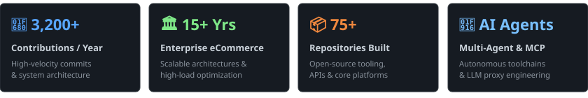

# 👑 Oleg Semenov (`@zyr3x`)

### ⚡ CTO @ [BelVG](https://belvg.com) • Head of AI Software Engineering • Enterprise Architect ⚡

  
  
  
  
  

---

## 📊 Engineering Impact & Activity

  <picture>
    <source media="(prefers-color-scheme: dark)" srcset="assets/metrics-dark.svg">
    <source media="(prefers-color-scheme: light)" srcset="assets/metrics-light.svg">
    
  </picture>

---

## 🌌 Executive Overview

- 🏢 **Leadership & Engineering**: **CTO @ [BelVG](https://belvg.com)** — driving enterprise technology strategy, technical leadership, and next-gen AI engineering.
- 🧠 **Autonomous AI & Multi-Agent Systems**: Designing high-throughput agent swarms, Model Context Protocol (MCP) toolchains, and LLM middleware integrations.
- 🛒 **15+ Years Enterprise eCommerce Architecture**: Architecting high-load platforms, custom ERP/CRM integrations, high-speed catalog pipelines, and resilient cloud backends.
- 🚀 **Flagship Platforms & OSS**: Core engineer behind **[fnxt.app](https://fnxt.app)**, **[belvg.com](https://belvg.com)**, **[deepmine.by](https://deepmine.by)**, and **[doka2.com](https://doka2.com)**.

---

## 🔮 Featured Platforms & Products

<table width="100%">
  <tr>
    <td width="50%" valign="top">
      <h3>⚡ <a href="https://fnxt.app">FNXT AI Benchmark</a></h3>
      
🔗 <a href="https://fnxt.app">https://fnxt.app</a>

      
Next-gen quantitative benchmark platform evaluating multi-model AI capabilities, empirical reasoning scores, autonomous strategy execution, and real-time market intelligence across Crypto &amp; RWA.

      

        
        
        
      

    </td>
    <td width="50%" valign="top">
      <h3>🛍️ <a href="https://belvg.com">BelVG Enterprise Ecosystem</a></h3>
      
🔗 <a href="https://belvg.com">https://belvg.com</a>

      
15+ years directing enterprise technology strategy and engineering high-load eCommerce ecosystems, custom microservices, high-speed indexing pipelines, and payment gateways for global merchants.

      

        
        
        
      

    </td>
  </tr>
  <tr>
    <td width="50%" valign="top">
      <h3>📻 <a href="https://deepmine.by">Deepmine Radio</a></h3>
      
🔗 <a href="https://deepmine.by">https://deepmine.by</a>

      
Independent electronic music portal &amp; online radio station broadcasting curated Deep Tech House, Tech House, and Minimal Techno sets with Icecast 2 streaming daemons.

      

        
        
        
      

    </td>
    <td width="50%" valign="top">
      <h3>🎮 <a href="https://doka2.com">DOKA 2: Defense Of Kingdom's Ancients</a></h3>
      
🔗 <a href="https://doka2.com">https://doka2.com</a>

      
Browser-based 2.5D pixel-art MOBA and real-time multiplayer engine featuring 41 heroes, 43 items, tactical bot AI, WebSocket state synchronization, and PixiJS 8 rendering.

      

        
        
        
      

    </td>
  </tr>
</table>

---

## 🌟 Open Source & AI Tooling

<table width="100%">
  <tr>
    <td width="50%" valign="top">
      <h3>🚀 <a href="https://github.com/zyr3x/opengeminiai-studio">OpenGemini AI Studio</a></h3>
      
🔗 <a href="https://github.com/zyr3x/opengeminiai-studio">github.com/zyr3x/opengeminiai-studio</a>

      
Advanced, ultra-lightweight proxy enabling seamless integration of Google Gemini API with any OpenAI API-compatible client or developer tool with zero code changes.

      

        
        
        
      

    </td>
    <td width="50%" valign="top">
      <h3>🤖 <a href="https://github.com/zyr3x/antigravity-telegram-bridge">Antigravity Telegram Bridge</a></h3>
      
🔗 <a href="https://github.com/zyr3x/antigravity-telegram-bridge">github.com/zyr3x/antigravity-telegram-bridge</a>

      
Universal Telegram chat and control interface for Google Antigravity autonomous AI agents with bidirectional communication, telemetry, and proactive notifications.

      

        
        
        
      

    </td>
  </tr>
</table>

---

## 🛠️ Complete Tech Stack & Toolbelt

### 🤖 AI, LLMs & Multi-Agent Swarms

  
  
  
  
  
  
  
  
  
  

### 🧠 Vector Databases & Data Architecture

  
  
  
  
  
  
  
  
  

### ☁️ Cloud, DevOps & High-Load Infrastructure

  
  
  
  
  
  
  
  
  
  

### 💻 Programming Languages

  
  
  
  
  
  
  
  

### 🏗️ Backend, Frameworks & Enterprise eCommerce

  
  
  
  
  
  
  
  

---

  <i>"Engineering autonomous intelligence and scalable architectures at the intersection of AI and commerce."</i>

